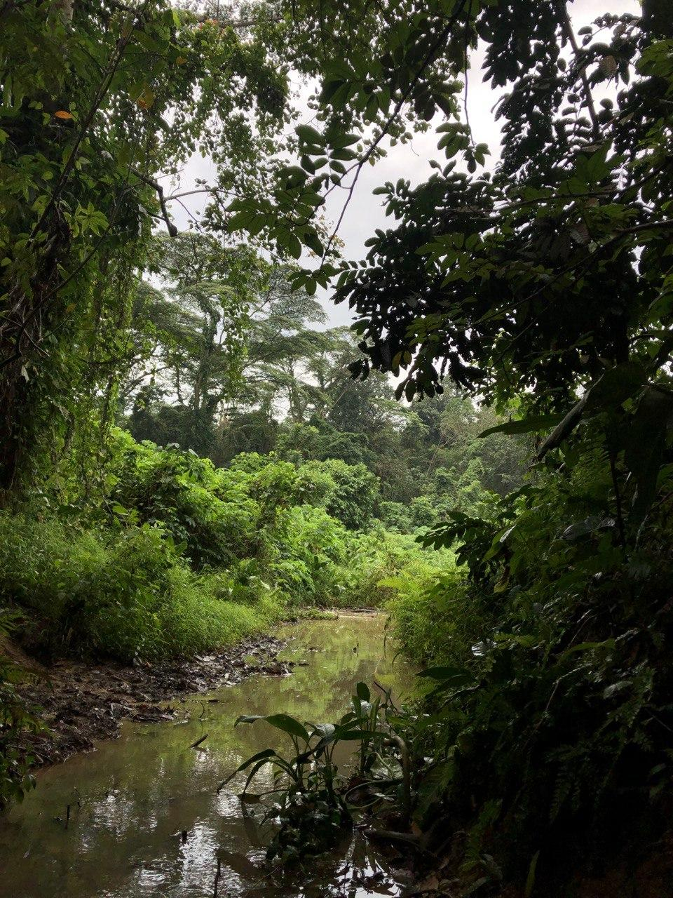
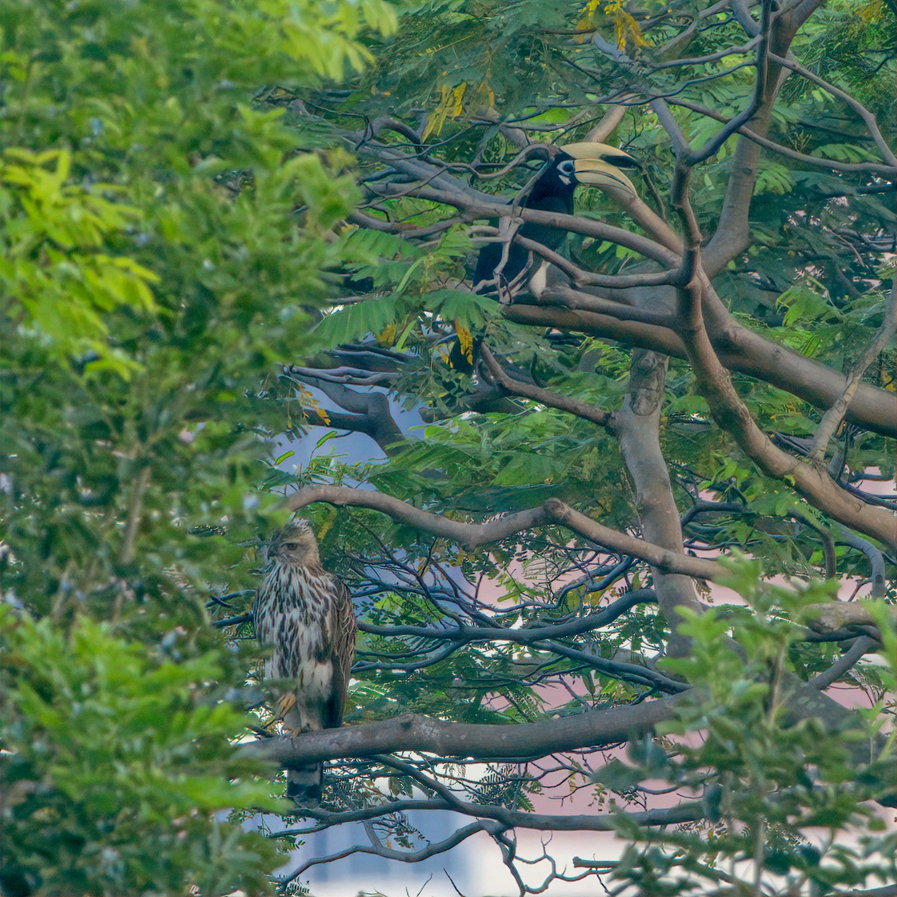
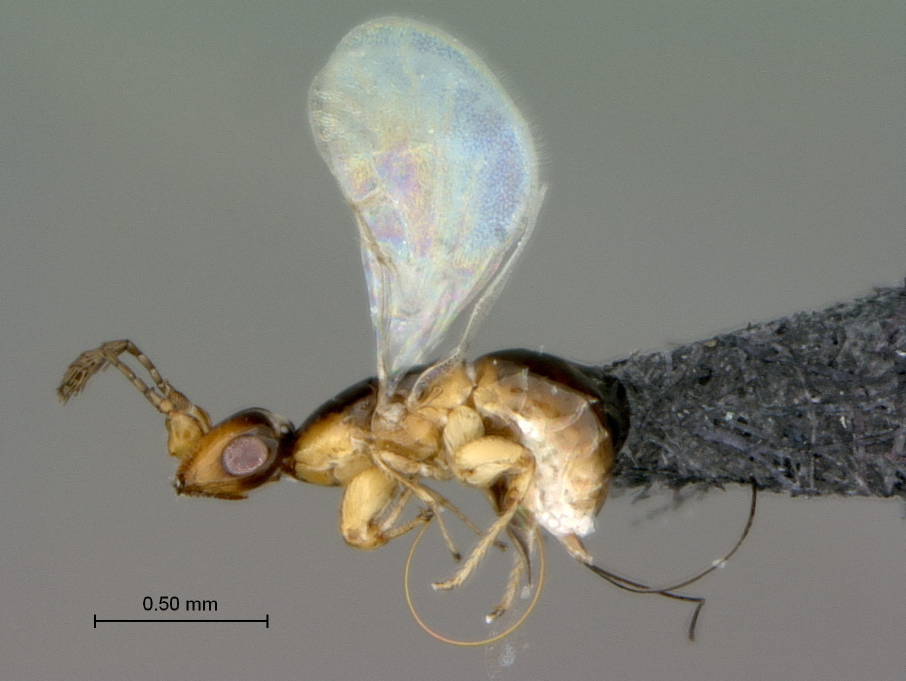
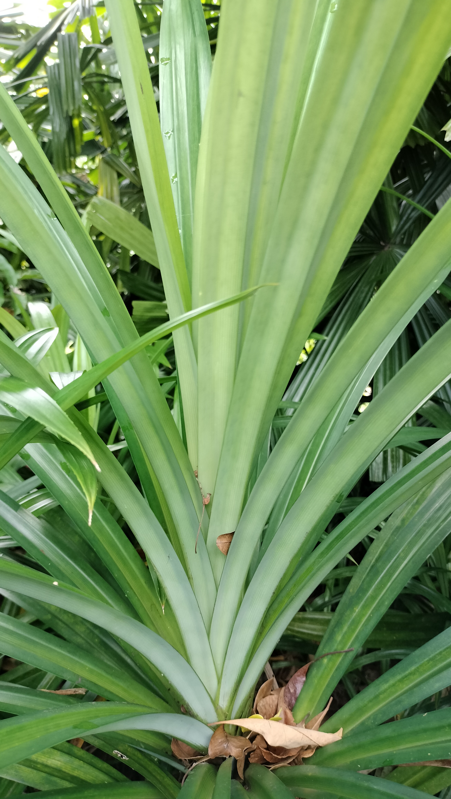
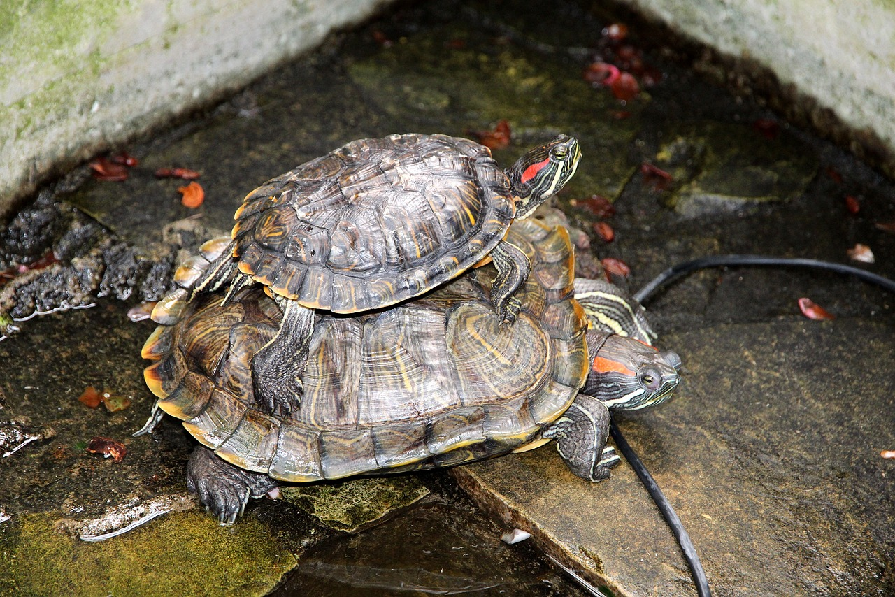

.ve-header "Biodiversity Stories" src:https://raw.githubusercontent.com/Digital-Scholarship-NUS-Libraries/biodiversitystories/main/media/10-jul-update-juncture-banner.jpg "Cultural and Environmental Histories of Introduced Species in Singapore and Southeast Asia" full sticky
    - [Home](/)
    - [About](/about)
    - [Authors](/authors) 
   
### {.cards}

#### Betel Nut Palm and Betel Leaf (*Areca catechu* and *Piper betle*) {href=https://www.juncture-digital.org/Digital-Scholarship-NUS-Libraries/biodiversitystories/Betel-nut%20Palm}

"Masticatory, Medicinal & More: The “Betel-Nut Palm” in Singapore and Southeast Asia" 
 **Joyce Hu**

#### Blue Pea (*Clitoria ternatea*) {href=https://www.juncture-digital.org/Digital-Scholarship-NUS-Libraries/biodiversitystories/Blue%20Pea}

"Blue Pea: Forging Friendships from Soil to Garden to Kitchen"
     **Sun Woo Yoon**

#### Clementi Forest {href=https://www.juncture-digital.org/Digital-Scholarship-NUS-Libraries/biodiversitystories/Clementi%20Forest}

"Clementi Forest: From Rubber Plantation to Urban Forest with an Uncertain Future"
     **Angela Ricasio Hoten**

#### Dengue Mosquito (*Aedes aegypti*) {href=https://www.juncture-digital.org/Digital-Scholarship-NUS-Libraries/biodiversitystories/Dengue%20Mosquito}

"*Aedes aegypti* : Not All Black and White"
     **Yeo Huiqing**

#### Dover Forest {href=https://www.juncture-digital.org/Digital-Scholarship-NUS-Libraries/biodiversitystories/Dover%20Forest}

"Dover Forest: The Fight to Protect Vanishing Ecosystems"
     **Angela Ricasio Hoten**

#### Fig Wasp (*Platyscapa quadraticeps*) {href=https://www.juncture-digital.org/Digital-Scholarship-NUS-Libraries/biodiversitystories/Fig%20Wasp/}

"The Fig Wasp: A Fundamental yet Forgotten Pollinator in Urban Green Spaces"
   **Joyce Hu**

#### Guava (*Psidium guajava*) {href=https://www.juncture-digital.org/Digital-Scholarship-NUS-Libraries/biodiversitystories/Guava}

"Guava: An Exciting Delicacy across Southeast Asian Cultures"
    **Dünya Gürses**

#### Günther's Frog (*Sylvirana guentheri*) {href=https://www.juncture-digital.org/Digital-Scholarship-NUS-Libraries/biodiversitystories/G%C3%BCnther's%20Frog/}

"Günther's Frog: New Landscapes and New Habitats"
     **Sun Woo Yoon**

#### Jaguar Cichlid (*Parachromis managuensis*) {href=https://www.juncture-digital.org/Digital-Scholarship-NUS-Libraries/biodiversitystories/Jaguar%20cichlid}

"Jaguar Cichlid: Beauty Pageant, Tropical Predator" 
    **Max D. López Toledano**

#### Pandan (*Pandanus amaryllifolius*) and the Ant Mosquito (*Malaya genurostris*) {href=https://www.juncture-digital.org/Digital-Scholarship-NUS-Libraries/biodiversitystories/Pandan}

"Pandan: The Essence of Home"
    **Yeo Huiqing**

#### Pápalo (_Porophyllum ruderale_) {href=https://www.juncture-digital.org/Digital-Scholarship-NUS-Libraries/biodiversitystories/Porophyllum-ruderale}

"Pápalo: Lost in Translation" 
      **Max D. López Toledano**

#### Red-eared Slider (*Trachemys scripta elegans*) {href=https://www.juncture-digital.org/Digital-Scholarship-NUS-Libraries/biodiversitystories/Red-eared%20slider}

"Red-eared Sliders in Singapore: From Exotic Pet to Released Pest"
    **Dünya Gürses**

#### Sacred Fig (_Ficus religiosa_) {href=https://www.juncture-digital.org/Digital-Scholarship-NUS-Libraries/biodiversitystories/Sacred%20Fig}

"Religion’s Living Roots: The Sacred _Ficus religiosa_" 
     **Foo Shi Wen**

#### Tapioca (*Manihot esculenta*) {href=https://www.juncture-digital.org/Digital-Scholarship-NUS-Libraries/biodiversitystories/Tapioca}

"Tapioca: Despised or Delicacy?"
      **Jody Lim**

.ve-footer
    - Powered by:  Linking the Digital Humanities to Biodiversity History in Singapore and Southeast Asia
    - Supported by: 
