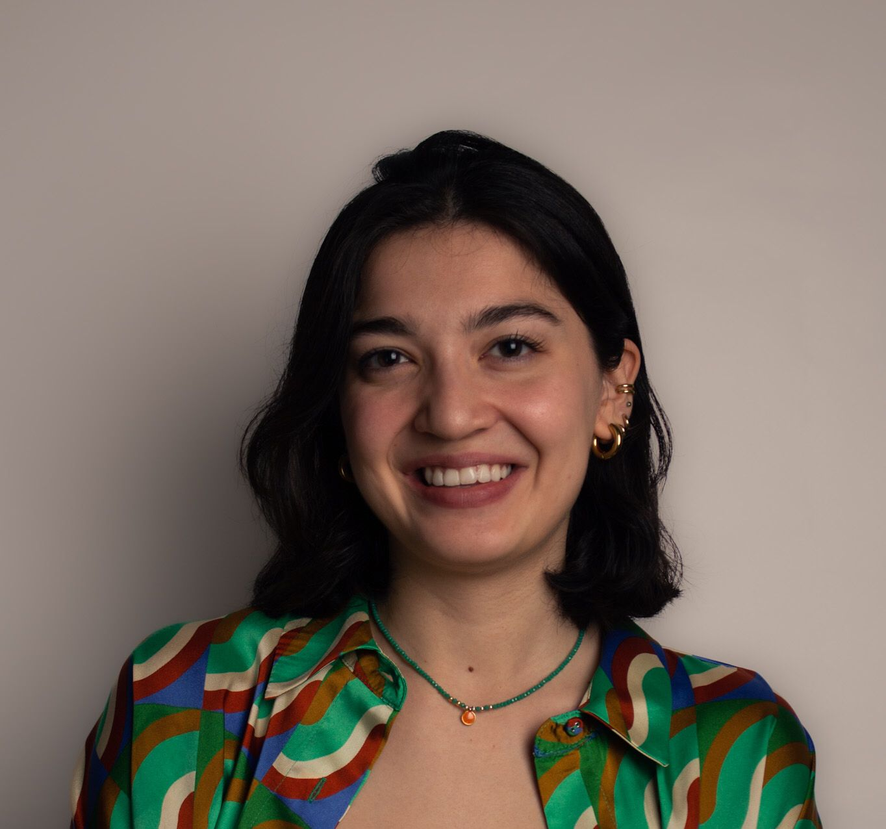
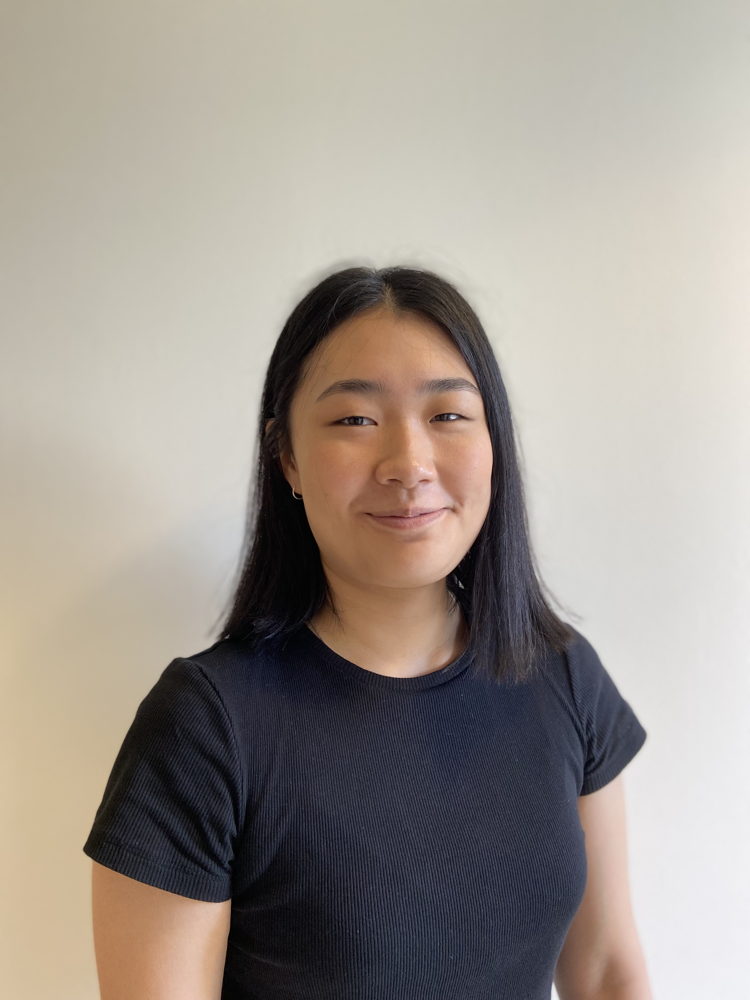
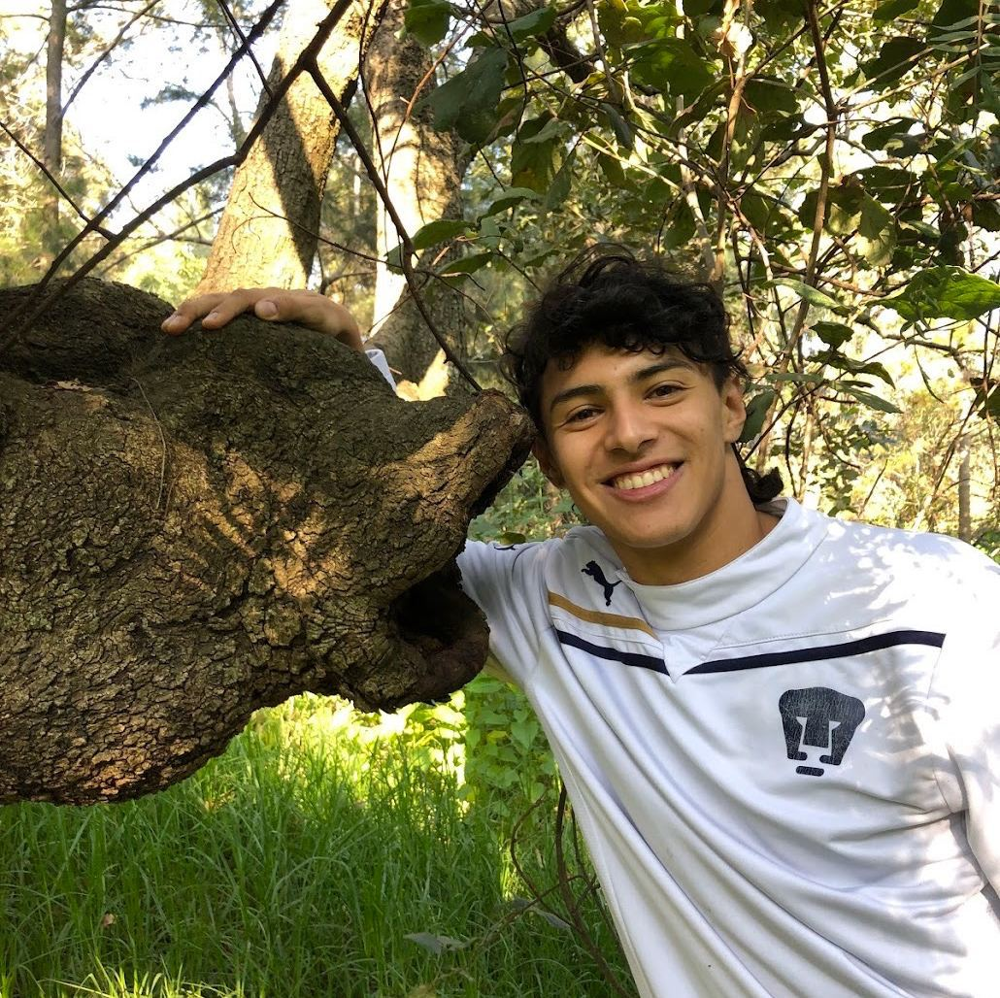
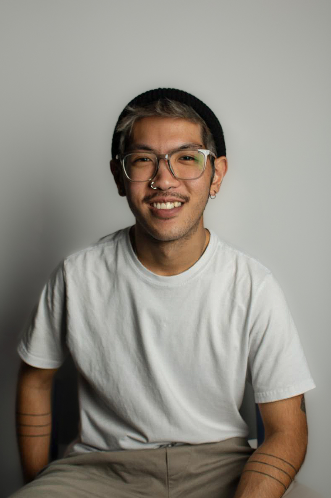

.ve-header "Biodiversity Stories" src:https://raw.githubusercontent.com/KatherineMEnright/speciesstories/main/media/new-banner.jpg  "Cultural and Environmental Histories of Introduced Species in Singapore and Southeast Asia" full sticky
    - [Home](/)
    - [About](/about)
    - [Authors](/authors)
       
### Story Authors {.cards}

####  Foo Shi Wen

Shi Wen is a student at Yale-NUS college.

####  Dünya Gürses

Dünya is a recent graduate of Yale-NUS College with a major in Urban Studies and a minor in Environmental Studies. She is passionate about urban sustainability issues and believes in the importance of building cities for all living beings. She enjoys reading and journaling in her free time.

####  Angela Ricasio Hoten

Angela is a researcher, environmental activist, and forest advocate. Through the lens of anthropology, Angela seeks to uncover the webs of relation between people and their environments. She is a coordinator with Students for a Fossil-Free Future, a community organiser for GreenCheck, and an avid visitor of the Clementi Forest. 

####  Joyce Hu

Joyce is a rising senior at Yale-NUS College majoring in Environmental Studies. She is interested in both the science and cultural aspects of ecology and biodiversity as well as public and environmental health. Among other things, she enjoys hiking, music, cheesecake, and talking about the weather.

####  Jody Lim

####  Max D. López Toledano

Max (they/she) did their undergraduate studies in Anthropology at Yale-NUS College. Their research interests are broad, including sports, environmental anthropology, and STS, though queer and decolonial perspectives are always part of her work. Max is also a football player and a long-distance runner.

####  Yeo Huiqing

Huiqing is a student research assistant under the ‘Linking the Digital Humanities to Biodiversity History in Singapore and Southeast Asia’ project at Yale-NUS. She has a PhD in Life Sciences from the National University of Singapore, and her research focuses on biodiversity and evolution of mosquitoes.

#### Sun Woo Yoon

Sun Woo is an artist, researcher, and environmental activist. He works with a variety of media through which he explores environmental histories with a keen interest on the ocean. He is active at Students for a Fossil Free Future, Extinction Rebellion NYC, and GreenCheck where he is an artist-activist, strategist, and design mentor.

.ve-footer
    - Powered by: 
    - Supported by: 

